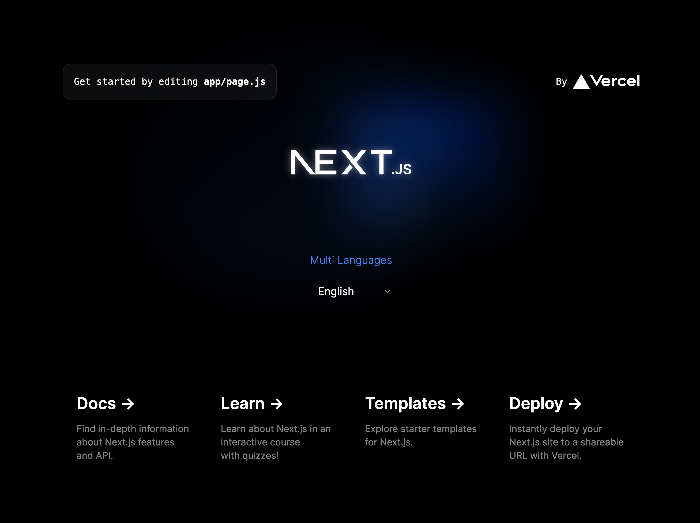

This is a [Next.js](https://nextjs.org/) project bootstrapped with [`create-next-app`](https://github.com/vercel/next.js/tree/canary/packages/create-next-app).

## Introduction

This is a next js 14 with multi-language(i18n) setup following the guide in NEXT's official doc. (https://nextjs.org/docs/app/building-your-application/routing/internationalization).

## features

- light weight minimum setup.
- only installed two packages: negotiator & @formatjs/intl-localematcher.
- using the method recommended in Next official documentation on internationalization.

## structure

@ represents root

#### @/lib/lang.js

- configuration app's available languages and default language.

#### @/middleware.js

- detect client browser languages through request header.
- determine suitable language based using negotiator and @formatjs/intl-localematcher.

#### @/lib/dictionaries/[langCode].json

- created json dictionary files in accordance with lang.js configeration.
- each json file is named in language code.

#### @/lib/dictionary.js

- provides function to dynamic import the dictionary based on current locale.

#### restructured app folder

- moved root page.js and layout.js into [lang]
- the home page now located at app/[lang]/page.js
- new route: app/[lang]/newroute/page.js
- it doesn't affect api folder: app/api/...
- it also doesn't affect favicon.ico, globals.css
- if you want to change the structure, it can be configured in middleware.

#### created @/components/global/LangToggle.jsx

- a component detects and current language
- switch the language of the app

#### modified home page

- example usage of dictionaries and languge toggle component in app
